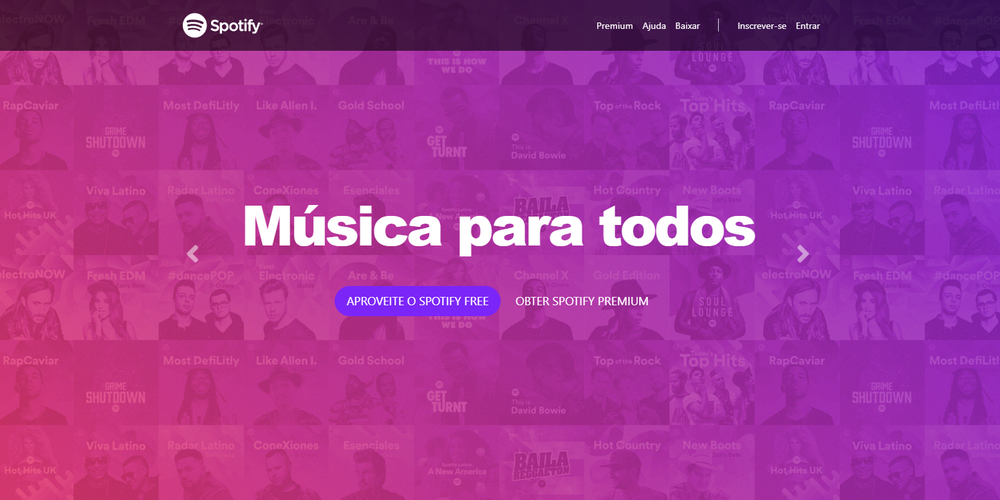

# Spotify 🎵

You can access it with this [link.](https://spiffy-daffodil-c94357.netlify.app/)
# 💻 About the project 
The Spotify clone project has been developed for a long time, it has a static and visually pleasing layout. With harmonious graphics and colors, I created this project with the intention of improving my skills in Bootstrap technology.
# 🚀 Technologies 
Spotify clone was developed using the following technologies:

- HTML5
- CSS3
- BootStrap
- Netlify
# 🛠️ How to install the project and run it on your machine
To install and run the project, follow the steps below:

- Clone this repository to your local environment:
```bash
git clone https://github.com/devpdro/project-spotify-clone.git
```
- Navigate to the project directory:
```bash
cd project-spotify-clone
```

Made with ❤️ by Victor Hugo 👋
